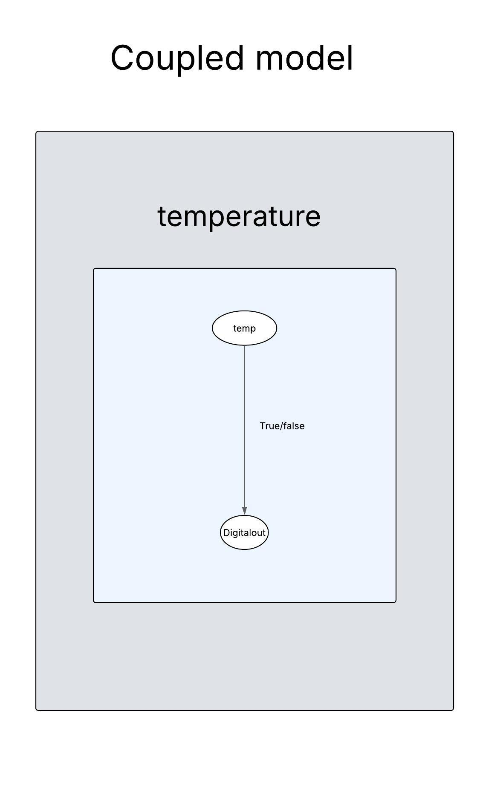

# stm32_temperature
This project is a DEVS-based example running on an STM32H743ZI2 development board. It models a realtime temperature sensor were if the temperature is more the 25C it turns a LED off.

## Features

- Real-time temperature monitoring
- Implemented using the DEVS formalism with Cadmium
- Runs on STM32H743ZI2 using ARM toolchain

## Prerequisites

- STM32H743ZI2 development board connected via USB
- Cadmium simulator installed
- ARM toolchain: `gcc-arm-none-eabi`

## Installation

1. **Install the ARM GCC toolchain**:

```bash
sudo apt install gcc-arm-none-eabi
```
## Wiring and running 
1. **Wirning**:
### DHT11 – Temperature Sensor

| Signal | DHT11  Pin | STM32 Pin Example | Notes                        |
|--------|------------|-------------------|------------------------------|
| VCC    | V+         | 5V                | Power supply                 |
| GND    | GND        | GND               | Common ground                |
| Out    | Out        | PB9               | Digital out                  |

---
2. **Running**:

```bash
git clone https://github.com/Ouabm/stm32_temperature.git
```
  then
```bash
cd stm32_temperature/
```
  then
```bash
./build_stm32
```

